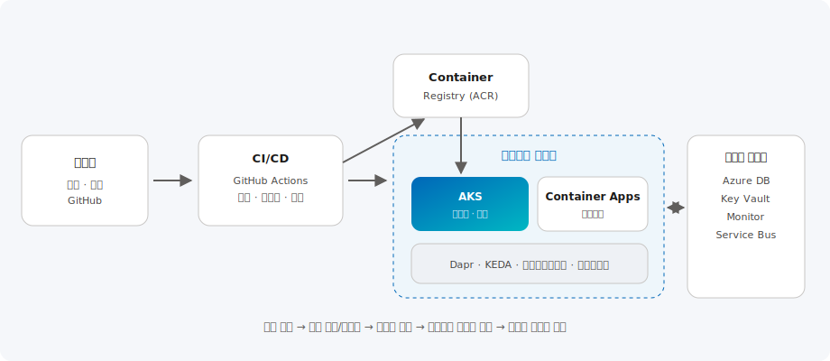

# 애플리케이션 현대화 & DevOps

> 모놀리식 애플리케이션을 컨테이너·마이크로서비스로 전환하고, AKS·Azure Container Apps와 GitHub Actions 기반 DevOps로 개발 생산성과 확장성을 확보하는 솔루션을 제공합니다.

| 항목 | 내용 |
| --- | --- |
| 카테고리 | App Innovation |
| 난이도 | L200 ~ L400 |
| 대상 | 애플리케이션 개발자 · 플랫폼 엔지니어 · DevOps 담당자 |
| 관련 서비스 | Azure Kubernetes Service, Azure Container Apps, GitHub Actions, Azure Container Registry |

---

## 이 솔루션에서 다루는 내용

앱 현대화는 컨테이너화·실행 환경 선택·CI/CD·관측성·보안을 아우릅니다. 본 문서는 아래 6개 영역으로 나누어 다룹니다.

| 영역 | 다루는 주제 | 핵심 서비스 |
| --- | --- | --- |
| **① 컨테이너화** | Dockerfile, 이미지 빌드·스캔 | Azure Container Registry |
| **② 실행 환경** | AKS·Container Apps·App Service 선택 | AKS, Container Apps, App Service |
| **③ 마이크로서비스** | 서비스 통신·이벤트 오토스케일 | Dapr, KEDA |
| **④ CI/CD·IaC** | 빌드·테스트·배포 자동화, 인프라 코드화 | GitHub Actions, Bicep/Terraform |
| **⑤ 보안·네트워크** | 워크로드 ID, 프라이빗 클러스터, WAF | Entra Workload ID, Key Vault |
| **⑥ 관측성** | 지표·로그·분산 추적 | Azure Monitor, App Insights |

---

## 개요

레거시 모놀리식 애플리케이션은 배포 주기가 길고, 부분 확장이 어려우며, 특정 기술 스택에 종속되기 쉽습니다.
애플리케이션 현대화는 애플리케이션을 **컨테이너화**하고, 필요에 따라 **마이크로서비스**로 분해하며,
**CI/CD 자동화**로 배포를 빠르고 안정적으로 만드는 여정입니다.

Azure는 워크로드 특성에 맞춰 컨테이너 실행 환경을 선택할 수 있습니다.
세밀한 제어와 대규모 오케스트레이션이 필요하면 **Azure Kubernetes Service(AKS)**, 인프라 관리 부담 없이 서버리스로
마이크로서비스를 운영하려면 **Azure Container Apps**, 단일 웹앱 중심이면 **App Service**가 적합합니다.
여기에 **GitHub Actions**로 빌드·테스트·배포를 자동화해 DevOps 문화를 정착시킵니다.

## 아키텍처



Microsoft 아키텍처 센터의 **AKS 기준(Baseline) 아키텍처**를 참고한 구성입니다.

1. 개발자가 코드를 **GitHub**에 커밋하면 **GitHub Actions** 파이프라인이 빌드·테스트를 자동 수행합니다.
2. 컨테이너 이미지를 **Azure Container Registry(ACR)** 에 푸시하고 취약점을 스캔합니다.
3. **AKS** 또는 **Azure Container Apps**에 이미지를 배포합니다. Dapr·KEDA로 마이크로서비스 통신과 이벤트 기반 오토스케일을 구현합니다.
4. 애플리케이션은 **Azure Database·Key Vault·Service Bus·Monitor** 등 관리형 서비스와 안전하게 연동됩니다.

```text
개발자 커밋 → GitHub Actions(빌드·테스트) → ACR(이미지 푸시·스캔)
   → AKS 또는 Container Apps 배포 (Dapr·KEDA)
   → 관리형 서비스(DB·Key Vault·Service Bus) 연동
   ↑ Azure Monitor·App Insights로 지표·로그·추적 통합
```

---

## 핵심 서비스 상세

### ① Azure Kubernetes Service(AKS) — 관리형 Kubernetes

**무엇인가.** 관리형 Kubernetes 서비스로, 대규모·복잡한 마이크로서비스와 세밀한 제어가 필요한 워크로드에 적합합니다.

**기본 기능** — 노드 풀·오토스케일(HPA/Cluster Autoscaler), 롤링 업데이트, 프라이빗 클러스터, 애저 관리형 애드온(GitOps·Key Vault 등).

**최신 업데이트** — **AKS Automatic**(모범 사례 기반 간소화된 클러스터), **Node Autoprovisioning(Karpenter 기반)**, 워크로드 ID·보안 기본값 강화.

**어떤 시나리오에서 쓰나** — 대규모 코어 시스템, 하이브리드/멀티클라우드, K8s 생태계(Helm·Operator) 활용.

### ② Azure Container Apps — 서버리스 컨테이너

**무엇인가.** Kubernetes 전문성 없이 컨테이너 마이크로서비스를 서버리스로 운영하는 관리형 환경입니다. **Dapr·KEDA**가 내장되어 있습니다.

**기본 기능** — 0으로 스케일(scale-to-zero), 이벤트 기반 오토스케일, 마이크로서비스 간 서비스 디스커버리, 롤링 릴리스.

**최신 업데이트** — **서버리스 GPU** 지원(AI 추론 워크로드), 전용 워크로드 프로파일, 다이나믹 세션(간헐적 작업) 강화.

**구성 예시 — Container Apps 배포(Azure CLI)**

```bash
# 환경 생성 후 컨테이너 앱 배포 (0으로 스케일 기본)
az containerapp create \
  --name api --resource-group rg-app \
  --environment aca-env \
  --image myacr.azurecr.io/api:1.0 \
  --target-port 8080 --ingress external \
  --min-replicas 0 --max-replicas 10
```

### ③ Azure Container Registry(ACR) — 이미지 레지스트리

**무엇인가.** 프라이빗 컨테이너 이미지 레지스트리로, 이미지 서명과 **취약점 스캔**(Defender for Cloud 연동)을 제공합니다.

**구성 예시 — 이미지 빌드·푸시(GitHub Actions 단계)**

```yaml
- name: Build and push
  run: |
    az acr build --registry myacr \
      --image api:${{ github.sha }} .
```

### ④ GitHub Actions · IaC — CI/CD

**무엇인가.** 빌드·테스트·배포를 자동화하고, **Bicep/Terraform** 으로 인프라를 코드화해 환경별로 일관 배포합니다. OIDC 기반 **시크릿 없는** Azure 인증을 권장합니다.

> 마이그레이션은 단번에 재작성하기보다 우선 **컨테이너화(리프트&시프트)** 후 점진적으로 마이크로서비스를 분리하는 **스트랭글러(Strangler) 패턴**이 안전합니다.

## 실행 환경 선택 가이드

| 옵션 | 적합한 경우 |
| --- | --- |
| **App Service** | 단일/소수 웹앱, 빠른 리프트&시프트, 최소 운영 부담 |
| **Container Apps** | 마이크로서비스·이벤트 기반, 서버리스 오토스케일, K8s 전문성 불필요 |
| **AKS** | 대규모·복잡 오케스트레이션, 세밀한 제어, 하이브리드/멀티클라우드 |

## Azure 기본 구성

- **네트워크**: 프라이빗 클러스터·프라이빗 엔드포인트로 데이터·레지스트리를 사설망에 격리, 인그레스에 Application Gateway/WAF
- **보안**: Entra ID 워크로드 ID로 시크릿 없는 인증, Key Vault로 비밀 관리, ACR 이미지 스캔·서명
- **확장성**: HPA/KEDA로 부하 기반 오토스케일, 노드 풀 분리로 워크로드 격리
- **관측성**: Container Insights·Application Insights로 지표·로그·추적 통합
- **IaC/CD**: Bicep·Terraform으로 인프라 코드화, GitHub Actions로 환경별 승격 배포

## 한국 고객 적용 시나리오

- **커머스 · 스타트업**: 트래픽 변동이 큰 서비스를 Container Apps로 서버리스 운영해 피크 시 자동 확장, 비용 최적화
- **금융 · 대기업**: 대규모 코어 시스템을 AKS로 마이크로서비스화하고, 프라이빗 클러스터·WAF로 규제 요건 충족
- **SI · 제조**: 레거시 .NET/Java 앱을 컨테이너화해 App Service/AKS로 이전, GitHub Actions로 배포 자동화
- **공공**: IaC로 표준 환경을 코드화해 반복 배포·감사 대응, 랜딩존 위에 워크로드 배치

> 마이그레이션은 단번에 모든 것을 재작성하기보다, 우선 **컨테이너화(리프트&시프트)** 후 점진적으로 마이크로서비스를 분리하는 **스트랭글러(Strangler) 패턴**을 권장합니다.

## 고객 사례

- **글로벌 — 컨테이너 기반 현대화**: 금융·커머스·제조 기업들이 레거시 앱을 AKS·Container Apps로 이전하고 GitHub Actions로 배포를 자동화해 릴리스 주기를 단축했습니다. 상세는 [Microsoft 고객 사례](https://www.microsoft.com/ko-kr/customers)에서 확인할 수 있습니다.
- **패턴 — 서버리스 오토스케일**: 트래픽 변동이 큰 서비스를 Container Apps로 운영해 피크 시 자동 확장·비용 최적화하는 구성이 널리 채택됩니다.
- **패턴 — 스트랭글러 전환**: 모놀리스를 한 번에 바꾸지 않고 신규 기능부터 마이크로서비스로 점진 분리.

## 도입 단계 (구성 예시 포함)

### 1단계 · 평가 · 계획

- 애플리케이션 종속성·상태 분석, 마이그레이션 대상과 목표 런타임 선정

### 2단계 · 컨테이너화

- Dockerfile 작성, ACR 구성, 기존 앱을 이미지로 패키징

```bash
# ACR 생성 후 이미지 빌드(클라우드 빌드)
az acr create --resource-group rg-app --name myacr --sku Standard
az acr build --registry myacr --image api:1.0 .
```

### 3단계 · CI/CD · 배포

- GitHub Actions 파이프라인과 IaC로 자동 빌드·배포, AKS/Container Apps 구성

```yaml
# .github/workflows — OIDC 기반 시크릿 없는 배포
- uses: azure/login@v2
  with:
    client-id: ${{ secrets.AZURE_CLIENT_ID }}
    tenant-id: ${{ secrets.AZURE_TENANT_ID }}
    subscription-id: ${{ secrets.AZURE_SUBSCRIPTION_ID }}
```

### 4단계 · 운영 · 최적화

- 모니터링·오토스케일·보안 강화, 마이크로서비스 점진 분해 및 비용 최적화

## 기대 효과

- 배포 자동화로 릴리스 주기 단축과 배포 안정성 향상
- 컨테이너·오토스케일로 자원 효율화와 탄력적 확장
- 마이크로서비스화로 팀 독립 개발·부분 확장 가능, 장애 격리

## 참고 자료

- [Azure Kubernetes Service 설명서](https://learn.microsoft.com/ko-kr/azure/aks/)
- [AKS 기준(Baseline) 아키텍처](https://learn.microsoft.com/ko-kr/azure/architecture/reference-architectures/containers/aks/baseline-aks)
- [Azure Container Apps 설명서](https://learn.microsoft.com/ko-kr/azure/container-apps/)
- [GitHub Actions로 Azure 배포](https://learn.microsoft.com/ko-kr/azure/developer/github/github-actions)
- [실습(Hands-on) — AKS 시작하기 학습 경로](https://learn.microsoft.com/ko-kr/training/paths/intro-to-kubernetes-on-azure/)
- [실습(Hands-on) — Container Apps에 마이크로서비스 배포](https://learn.microsoft.com/ko-kr/training/modules/deploy-microservices-azure-container-apps/)
- [실습(Hands-on) — GitHub Actions로 컨테이너 CI/CD 구성](https://learn.microsoft.com/ko-kr/training/paths/build-applications-github-actions/)

---

_카테고리: App Innovation · 최종 업데이트: 2026-07-02_
