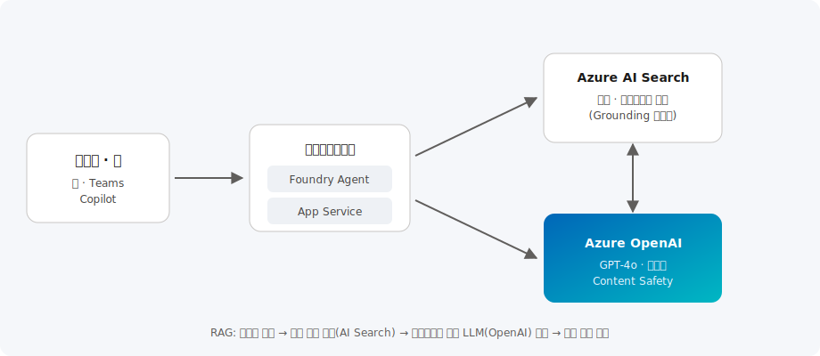

# Azure AI & Copilot

> Azure OpenAI와 Azure AI Foundry를 활용해 기업 데이터에 근거한(Grounded) 지능형 애플리케이션과 Copilot을 구축하는 레퍼런스 아키텍처와 도입 시나리오를 제공합니다.

| 항목 | 내용 |
| --- | --- |
| 카테고리 | AI |
| 난이도 | L200 ~ L400 |
| 대상 | AI 엔지니어 · 애플리케이션 개발자 · 데이터 과학자 |
| 관련 서비스 | Azure OpenAI, Azure AI Foundry, Azure AI Search, Azure AI Content Safety |

---

## 이 솔루션에서 다루는 내용

생성형 AI 도입은 모델 선택부터 데이터 근거화, 안전 장치, 평가·운영까지 여러 단계를 아우릅니다. 본 문서는 아래 6개 영역으로 나누어 다룹니다.

| 영역 | 다루는 주제 | 핵심 서비스 |
| --- | --- | --- |
| **① 모델·플랫폼** | 모델 카탈로그, 배포, 프롬프트/평가 수명 주기 | Azure AI Foundry, Azure OpenAI |
| **② 데이터 근거화(RAG)** | 문서 청킹·임베딩, 벡터/하이브리드 검색 | Azure AI Search |
| **③ 에이전트·오케스트레이션** | 도구 호출, 지식 연결, 멀티 에이전트 | Foundry Agent Service |
| **④ 안전·책임 있는 AI** | 유해 콘텐츠 필터, 프롬프트 실드, 근거성 검사 | Azure AI Content Safety |
| **⑤ 보안·네트워크** | 프라이빗 엔드포인트, 키리스 인증, RBAC | Entra ID, Private Link |
| **⑥ 평가·운영(LLMOps)** | 품질·근거성 평가, 관측성, 용량(PTU) 계획 | Azure Monitor, Foundry Evaluation |

---

## 개요

생성형 AI의 핵심 과제는 "환각(Hallucination)"을 줄이고 **기업의 실제 데이터에 근거한(Grounded) 정확한 답변**을 제공하는 것입니다. 범용 LLM은 학습 시점 이후의 정보나 사내 데이터를 알지 못하므로, 그대로 사용하면 그럴듯하지만 틀린 답을 낼 수 있습니다.

이를 해결하는 표준 패턴이 **RAG(Retrieval-Augmented Generation, 검색 증강 생성)** 입니다. 사용자의 질문과 관련된 문서를 먼저 검색(Retrieval)하고, 그 내용을 컨텍스트로 LLM에 전달(Augmented)하여 근거 있는 답변을 생성(Generation)합니다. 여기에 최근에는 **에이전트(Agent)** 패턴이 더해져, LLM이 단순 답변을 넘어 도구·API를 호출하고 여러 단계를 스스로 계획·수행하는 방향으로 발전하고 있습니다.

**Azure AI Foundry**(구 Azure AI Studio)는 모델 카탈로그, 프롬프트 관리, 평가(Evaluation), 안전(Safety), 에이전트 오케스트레이션까지 생성형 AI 애플리케이션의 전체 수명 주기를 지원하는 통합 플랫폼입니다. Azure는 **Migrate → Modernize** 가 아니라 **PoC → 근거화 → 안전 장치 → 평가 → 운영(LLMOps)** 의 흐름으로 AI 앱을 성숙시킵니다.

**왜 Azure인가**

- **엔터프라이즈 데이터 보호** — 입력·출력 데이터가 기반 모델 재학습에 사용되지 않으며, 프라이빗 네트워크·RBAC로 격리 가능
- **책임 있는 AI 내장** — Content Safety, 프롬프트 실드, 근거성 검사가 플랫폼 수준에서 제공
- **광범위한 모델 카탈로그** — OpenAI(GPT-4o, o-시리즈)뿐 아니라 Meta Llama, Mistral, Cohere 등 오픈/파트너 모델을 한 곳에서 선택

## 전체 아키텍처



Microsoft 아키텍처 센터의 **"Baseline OpenAI end-to-end chat"** 참조 아키텍처를 기반으로 합니다.

1. 사용자가 웹 앱·Teams·Copilot에서 질문을 입력합니다.
2. 오케스트레이션 계층(Foundry Agent 또는 App Service의 앱 코드)이 요청을 받습니다.
3. **Azure AI Search**에서 벡터·하이브리드 검색으로 질문과 관련된 문서 청크(Grounding 데이터)를 가져옵니다.
4. 검색 결과를 프롬프트 컨텍스트로 구성해 **Azure OpenAI(GPT-4o 등)** 에 전달합니다.
5. **Azure AI Content Safety**로 입력·출력을 필터링하고, 근거(출처)와 함께 응답을 반환합니다.

```text
질문 → 오케스트레이터 → [AI Search 검색: 벡터+키워드+시맨틱 랭커]
     → 프롬프트 조립(질문+근거) → Azure OpenAI 생성
     → Content Safety 필터 → 출처와 함께 답변
```

---

## 핵심 서비스 상세

### ① Azure AI Foundry — 통합 AI 개발 플랫폼

**무엇인가.** 모델 선택·프롬프트 플로우·평가·배포·모니터링을 아우르는 생성형 AI 개발 허브입니다. 포털과 SDK(Python/.NET/JS)로 프로젝트 단위 협업을 지원합니다.

**기본 기능** — 모델 카탈로그, 프롬프트 플로우(오케스트레이션 시각화), 평가(정확도·근거성·안전성), 배포·엔드포인트 관리, 관측성 통합.

**최신 업데이트**

- **Foundry Agent Service GA** — 도구 호출·지식 연결·멀티 에이전트 오케스트레이션을 관리형으로 배포
- **모델 라우터** — 요청을 비용/성능에 맞는 모델로 자동 라우팅
- **광범위한 모델 카탈로그** — OpenAI 외 Llama·Mistral·Cohere 등 오픈/파트너 모델 통합

**어떤 시나리오에서 쓰나** — RAG 챗봇 프로토타이핑, 프롬프트/모델 A·B 평가, 에이전트 워크플로 구축, 배포 후 품질 모니터링.

### ② Azure OpenAI Service — 엔터프라이즈 LLM

**무엇인가.** GPT-4o, GPT-4o mini, **o-시리즈 추론 모델**, 텍스트 임베딩(text-embedding-3) 등을 엔터프라이즈 SLA와 데이터 프라이버시 보장하에 제공합니다.

**기본 기능** — 챗 완성, 함수 호출(도구 사용), 임베딩, 비전(멀티모달), JSON 구조화 출력, 콘텐츠 필터.

**최신 업데이트** — **o-시리즈 추론 모델**(복잡한 다단계 추론), 멀티모달 실시간 처리, **프로비저닝된 처리량(PTU)** 로 지연·처리량 예측성 확보, 배치 API로 비용 절감.

**구성 예시 — 모델 배포(Azure CLI)**

```bash
# Azure OpenAI 리소스 생성
az cognitiveservices account create \
  --name aoai-kr --resource-group rg-ai \
  --kind OpenAI --sku S0 --location koreacentral

# GPT-4o 모델 배포
az cognitiveservices account deployment create \
  --name aoai-kr --resource-group rg-ai \
  --deployment-name gpt-4o \
  --model-name gpt-4o --model-version "2024-08-06" \
  --model-format OpenAI --sku-capacity 10 --sku-name Standard
```

### ③ Azure AI Search — RAG 지식 저장소

**무엇인가.** 벡터 검색과 키워드 검색을 결합한 **하이브리드 검색**에 **시맨틱 랭커**를 더해 RAG의 검색 품질을 끌어올리는 지식 저장소입니다.

**기본 기능** — 벡터·키워드·하이브리드 검색, 시맨틱 재순위, 통합 벡터화(청킹+임베딩 파이프라인), 인덱서(Blob·SQL·Cosmos 등 커넥터).

**최신 업데이트** — **통합 벡터화**로 청킹·임베딩을 서비스가 자동 처리, 에이전트형 검색(agentic retrieval) 지원 강화.

> 검색 품질이 곧 답변 품질입니다. 하이브리드 검색 + 시맨틱 랭커 조합이 벡터 단독보다 근거성(정확도)이 높은 것이 일반적입니다.

### ④ Azure AI Content Safety — 책임 있는 AI

**무엇인가.** 입력·출력의 유해 콘텐츠(증오·성적·폭력·자해)를 탐지하고, **프롬프트 실드**(탈옥/프롬프트 주입 방어), **근거성(Groundedness) 검사**(근거 없는 주장 탐지)를 제공합니다.

**어떤 시나리오에서 쓰나** — 대외 서비스 챗봇의 안전 필터, 규제 산업의 규정 준수, 사용자 입력 기반 프롬프트 주입 방어.

---

## 애플리케이션 패턴

| 패턴 | 설명 | 적합한 경우 |
| --- | --- | --- |
| **RAG** | 검색으로 근거를 확보해 답변 | 사내 문서·규정 기반 Q&A |
| **Fine-tuning** | 도메인 데이터로 모델 미세 조정 | 특정 어조·형식이 반복적으로 필요할 때 |
| **Agent / Tool use** | LLM이 API·함수를 호출해 작업 수행 | 예약·조회 등 액션이 필요한 워크플로 |
| **Multi-agent** | 역할별 에이전트가 협업 | 복잡한 다단계 업무 자동화 |

## Azure 기본 구성

- **모델 배포**: Azure AI Foundry에서 리전·용량(PTU 또는 Standard)을 선택해 GPT-4o와 임베딩 모델을 배포
- **네트워크**: Private Endpoint와 VNet 통합으로 OpenAI·AI Search를 사설망에 격리, 공용 접근 차단
- **인증**: Microsoft Entra ID 기반 관리 ID(Managed Identity)로 키리스(Keyless) 연결, RBAC로 권한 최소화
- **관측성**: Azure Monitor·Application Insights로 토큰 사용량·지연 시간·품질 지표 추적, Foundry의 평가 기능으로 정확도·근거성 모니터링

**구성 예시 — 키리스(Managed Identity) 인증 호출(Python)**

```python
from azure.identity import DefaultAzureCredential, get_bearer_token_provider
from openai import AzureOpenAI

# 키가 아닌 Entra ID 토큰으로 인증 (권장)
token_provider = get_bearer_token_provider(
    DefaultAzureCredential(),
    "https://cognitiveservices.azure.com/.default",
)
client = AzureOpenAI(
    azure_endpoint="https://aoai-kr.openai.azure.com/",
    azure_ad_token_provider=token_provider,
    api_version="2024-10-21",
)
resp = client.chat.completions.create(
    model="gpt-4o",
    messages=[{"role": "user", "content": "근거 기반으로 요약해줘"}],
)
```

## 한국 고객 적용 시나리오

- **금융 · 콜센터**: 상담 이력과 상품 약관을 RAG로 연결해 상담사에게 실시간 응대 가이드 제공, 통화 후 자동 요약으로 후처리(ACW) 시간 단축
- **제조 · 기술지원**: 수천 페이지의 장비 매뉴얼·정비 이력을 지식 베이스로 구축해 현장 엔지니어의 자연어 검색 지원
- **공공 · 민원**: 내부 규정·FAQ 기반의 민원 응대 챗봇으로 반복 질의를 자동화하고, 근거 문서 링크를 함께 제시해 신뢰성 확보
- **유통 · 사내지식**: SharePoint·Confluence 문서를 인덱싱해 신입 온보딩과 사내 지식 검색을 Copilot 형태로 제공

> 데이터 상주(Data Residency)가 중요한 국내 규제 산업은 **Korea Central** 리전에서 사용 가능한 모델을 우선 검토하고, 리전별 모델 가용성을 배포 전에 확인하는 것이 좋습니다.

## 고객 사례

- **글로벌 — 다양한 산업의 Copilot 도입**: 제조·금융·유통 기업들이 Azure OpenAI 기반 RAG로 사내 지식 검색과 고객 응대를 자동화하고 있으며, 상세 사례는 [Microsoft 고객 사례](https://www.microsoft.com/ko-kr/customers)에서 확인할 수 있습니다.
- **패턴 — 콜센터 어시스트**: 상담 중 실시간 근거 제시 + 통화 후 자동 요약으로 상담 시간과 후처리 시간을 함께 단축하는 구성이 널리 채택되고 있습니다.
- **패턴 — 개발자 생산성**: GitHub Copilot·Foundry 에이전트로 코드 생성·문서화·테스트를 지원해 개발 리드타임을 단축.

## 도입 단계

1. **유스케이스 정의 · PoC** — 명확한 업무 시나리오를 선정하고 소규모 RAG 프로토타입으로 가치 검증
2. **데이터 준비** — 문서 수집·청킹·임베딩, Azure AI Search 인덱스 구성 및 검색 품질 튜닝
3. **앱 개발 · 안전 장치** — 오케스트레이션 구현, Content Safety·프롬프트 실드 적용, 평가 파이프라인 구축
4. **운영 · 최적화(LLMOps)** — 관측성 기반 품질 모니터링, PTU 용량 계획, 비용·성능 최적화 및 지속적 평가

## 기대 효과

- 반복 지식 업무 자동화로 응대·검색 시간 대폭 단축
- 기업 데이터 기반의 정확하고 근거 있는 답변으로 신뢰성 확보
- 엔터프라이즈 보안·규정 준수를 유지하면서 생성형 AI 도입 가속

## 참고 자료

- [Azure OpenAI Service 설명서](https://learn.microsoft.com/ko-kr/azure/ai-services/openai/)
- [Azure AI Foundry 설명서](https://learn.microsoft.com/ko-kr/azure/ai-foundry/)
- [Foundry Agent Service 개요](https://learn.microsoft.com/ko-kr/azure/ai-foundry/agents/overview)
- [Azure AI Search — RAG 개요](https://learn.microsoft.com/ko-kr/azure/search/retrieval-augmented-generation-overview)
- [아키텍처 센터 — Baseline OpenAI end-to-end chat](https://learn.microsoft.com/ko-kr/azure/architecture/ai-ml/architecture/baseline-openai-e2e-chat)
- [실습(Hands-on) — Azure Search OpenAI Demo (RAG 챗봇)](https://github.com/Azure-Samples/azure-search-openai-demo)
- [실습(Hands-on) — Microsoft Learn: Azure OpenAI로 생성형 AI 앱 개발](https://learn.microsoft.com/ko-kr/training/paths/develop-ai-solutions-azure-openai/)
- [실습(Hands-on) — Foundry로 에이전트 만들기](https://learn.microsoft.com/ko-kr/training/paths/create-agents-azure-ai-foundry/)

---

_카테고리: AI · 최종 업데이트: 2026-07-02_
