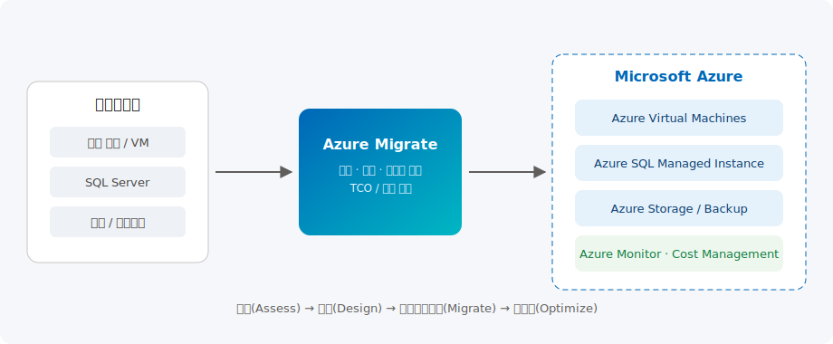
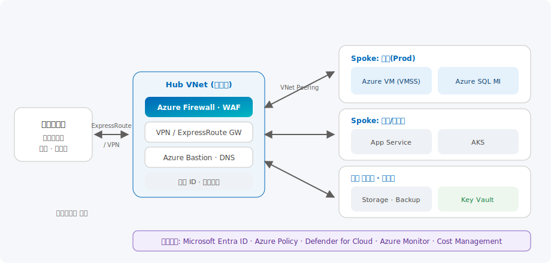

# 클라우드 마이그레이션

> 온프레미스·타 클라우드 워크로드를 Azure로 안전하게 이전하기 위한 전략(5R), 평가 도구(Azure Migrate), 랜딩 존 설계, 실행·최적화까지 전체 여정을 공식 프레임워크와 구성 예시로 안내합니다.

| 항목 | 내용 |
| --- | --- |
| 카테고리 | Azure |
| 난이도 | L200 ~ L400 |
| 대상 | 인프라 담당자 · 클라우드 아키텍트 · 마이그레이션 PM |
| 관련 서비스 | Azure Migrate, Azure Landing Zone, Azure VM, Azure SQL, Azure Site Recovery, Azure Backup |

---

## 이 솔루션에서 다루는 내용

클라우드 마이그레이션은 단일 작업이 아니라 여러 영역이 맞물린 프로젝트입니다. 본 문서는 아래 6개 영역으로 나누어 다룹니다.

| 영역 | 다루는 주제 | 핵심 서비스 |
| --- | --- | --- |
| **① 전략·계획** | 마이그레이션 동기, 5R 전략, CAF 프레임워크, 마이그레이션 웨이브 | Cloud Adoption Framework |
| **② 평가·발견** | 인벤토리 검색, 종속성 분석, 비즈니스 케이스(TCO) | Azure Migrate |
| **③ 랜딩 존·네트워크** | 구독 구조, Hub-Spoke, 하이브리드 연결, 명명·태그 | Azure Landing Zone, VNet, ExpressRoute |
| **④ 이전 실행** | 서버·DB·웹앱·대용량 데이터 이전, 최소 다운타임 | Site Recovery, DMS, Data Box |
| **⑤ 보안·거버넌스** | ID, 정책, 백업/재해복구, 규정 준수 | Entra ID, Azure Policy, Defender for Cloud |
| **⑥ 최적화·운영** | 크기 재조정, 예약/절감 플랜, 모니터링, 소스 폐기 | Cost Management, Azure Monitor, Advisor |

---

## 개요

많은 조직이 **하드웨어 노후화(EOL/EOS)**, 데이터센터 임대·전력·냉방 비용, **확장성 한계**, 재해 복구 취약성, 그리고 규정 준수(예: 데이터 주권) 요구로 클라우드 전환을 검토합니다. 여기에 최근에는 **AI·데이터 현대화의 기반**을 마련하기 위한 전략적 이유가 더해지고 있습니다.

Azure 마이그레이션은 단순 "Lift & Shift"를 넘어 **Migrate(이전) → Modernize(현대화) → Innovate(혁신)** 의 연속선상에서 접근합니다. 즉, 우선 빠르게 이전해 데이터센터를 벗어난 뒤(Exit), 관리형 서비스(PaaS)와 컨테이너로 점진적으로 현대화하고, 최종적으로 데이터·AI로 비즈니스 가치를 창출하는 흐름입니다.

이전 방식은 워크로드 특성에 따라 **5R** 중에서 선택합니다.

- **Rehost** — 변경 없이 그대로 이전(IaaS). 가장 빠르고 리스크가 낮음
- **Refactor** — 소폭 수정으로 PaaS 활용(예: SQL → Azure SQL MI, 웹앱 → App Service)
- **Rearchitect** — 클라우드 네이티브로 재설계(컨테이너·마이크로서비스)
- **Rebuild** — 요구사항을 못 맞추는 앱을 신규 구축
- **Replace** — 동등 기능의 SaaS로 대체(예: 사내 메일 → Microsoft 365)

본 솔루션은 Microsoft **Cloud Adoption Framework(CAF)** 의 마이그레이션 방법론 — **계획(Plan) → 준비(Prepare) → 실행(Execute) → 최적화(Optimize) → 소스 폐기(Decommission)** — 을 기준으로, 각 단계에서 사용하는 서비스와 구성 예시를 제공합니다.

## 전체 마이그레이션 여정



온프레미스(또는 타 클라우드) 환경을 **Azure Migrate**로 검색·평가한 뒤, 검증된 워크로드를 랜딩 존 위의 Azure 가상 머신, 관리형 데이터베이스, 스토리지로 이전합니다. 이전된 리소스는 Hub-Spoke 네트워크와 Azure Backup, Azure Monitor로 보호·관제됩니다.

```text
발견(Discover) → 평가(Assess) → 비즈니스 케이스 → 랜딩 존 준비 → 파일럿 이전
   → 웨이브 이전(Replicate·Cutover) → 검증 → 최적화(Right-size·예약) → 소스 폐기
```

---

## 핵심 서비스 상세

### ① Azure Migrate — 통합 마이그레이션 허브

**무엇인가.** Azure Migrate는 서버·데이터베이스·웹앱을 **검색·평가·이전**하는 중앙 허브 서비스입니다. **무료**로 제공되며 단일 포털에서 마이그레이션을 시작·실행·추적합니다.

**기본 기능**

- **검색(Discovery)** — 경량 **Azure Migrate 어플라이언스**(가상 어플라이언스)를 데이터센터에 배포해 구성·성능 데이터를 지속 수집. VMware, Hyper-V, 물리 서버, 타 클라우드 VM 지원
- **평가(Assessment)** — Azure 준비 상태, **Right-sizing**(VM/SQL 크기 산정), 비용 추정 제공
- **종속성 분석(Dependency Analysis)** — 서버 간 네트워크 종속성을 시각화해 함께 이전할 그룹(웨이브)을 안전하게 도출
- **비즈니스 케이스(Business Case)** — 온프레미스 대비 Azure TCO, 연도별 현금 흐름, CapEx→OpEx 절감 효과를 정량화

**최신 업데이트**

- **Azure Copilot 마이그레이션 에이전트(미리 보기)** — 대화형 인터페이스로 발견된 인벤토리 탐색, Azure 준비 상태 평가, 전략 비교, 비즈니스 케이스 해석, 맞춤형 **랜딩 존 템플릿** 생성·다운로드 지원
- **Azure Migrate Collector** — 어플라이언스 배포가 어려운 **폐쇄망/에어갭 환경**에서 스냅샷 방식으로 빠르게 인벤토리 발견
- **애플리케이션 중심(멀티 티어) 마이그레이션** — 개별 서버가 아닌 애플리케이션 단위로 워크로드를 묶어 계획·실행

**어떤 시나리오에서 쓰나**

- VMware/Hyper-V 대규모 서버 팜을 **에이전트리스**로 발견·평가 후 Azure VM으로 이전
- 데이터센터 종료(Exit) 기한이 정해진 상황에서 종속성 기반 웨이브 계획 수립
- 경영진 승인을 위한 TCO/ROI 비즈니스 케이스 산출

**구성 예시 — Azure Migrate 프로젝트 생성 및 발견 시작**

```bash
# 1) 마이그레이션 프로젝트용 리소스 그룹
az group create --name rg-migrate-hub --location koreacentral

# 2) Azure Migrate 프로젝트 생성 (Migrate 확장 사용)
az extension add --name migrate
az migrate project create \
  --resource-group rg-migrate-hub \
  --name migrate-prj-kr \
  --location koreacentral

# 이후 포털/어플라이언스에서 검색·평가·비즈니스 케이스를 실행합니다.
# 어플라이언스는 OVA(VMware)/VHD(Hyper-V) 또는 스크립트로 온프레미스에 배포합니다.
```

> 어플라이언스는 아웃바운드 HTTPS(443)로 Azure Migrate 서비스와 통신하며, 지속적으로 구성·성능 데이터를 전송해 정확한 Right-sizing과 종속성 맵을 만듭니다.

### ② 워크로드별 이전 도구

| 워크로드 | 도구 | 대상(예시) | 방식 |
| --- | --- | --- | --- |
| **서버(VM/물리)** | Migrate and Modernize, Azure Site Recovery | Azure VM / VMSS | 에이전트리스·에이전트 기반 복제 후 Cutover |
| **SQL Server** | Data Migration Assistant(평가), Azure Database Migration Service(DMS) | Azure SQL MI / SQL DB / SQL on VM | 온라인(최소 다운타임)·오프라인 |
| **오픈소스 DB** | Azure DMS | Azure DB for PostgreSQL / MySQL | 온라인 복제 |
| **웹앱(.NET/PHP)** | App Service Migration Assistant | Azure App Service / AKS | 에이전트리스, 대량 이전 |
| **대용량 데이터(오프라인)** | Azure Data Box | Azure Storage | 물리 디바이스 배송 |

**데이터베이스 이전 시나리오 예시**

- 온프레미스 SQL Server → **Azure SQL Managed Instance**: 최소한의 코드 변경으로 SQL Server 호환성을 유지하며 이전(Refactor)
- 애플리케이션을 그대로 유지해야 하면 **SQL on Azure VM**(Rehost), 서버리스·완전 관리형을 원하면 **Azure SQL Database**

### ③ 랜딩 존 & 네트워크 설계

**무엇인가.** **Azure 랜딩 존(Landing Zone)** 은 워크로드를 올리기 전에 구독 구조, 네트워크, ID, 보안, 거버넌스를 표준화한 "확장 가능한 기초 환경"입니다. CAF의 **Ready** 단계에서 구성하며, Enterprise-scale 참조 아키텍처와 IaC(Bicep/Terraform) 템플릿으로 배포합니다.



**Hub-Spoke 토폴로지**

- **Hub VNet(플랫폼)** — Azure Firewall/WAF, VPN·ExpressRoute 게이트웨이, Azure Bastion, DNS 등 공유 서비스
- **Spoke VNet(워크로드)** — 운영/개발/공유데이터 등 용도별로 분리, Hub와 **VNet Peering**으로 연결
- **하이브리드 연결** — 온프레미스와는 **ExpressRoute**(전용선) 또는 **VPN**으로 연결

**구성 예시 — Hub-Spoke 네트워크 골격(Azure CLI)**

```bash
# Hub VNet + 게이트웨이/방화벽 서브넷
az network vnet create -g rg-platform -n vnet-hub \
  --address-prefixes 10.0.0.0/16 \
  --subnet-name AzureFirewallSubnet --subnet-prefixes 10.0.0.0/26

# Spoke VNet (운영 워크로드)
az network vnet create -g rg-prod -n vnet-spoke-prod \
  --address-prefixes 10.1.0.0/16 \
  --subnet-name snet-app --subnet-prefixes 10.1.0.0/24

# Hub <-> Spoke 피어링 (양방향)
az network vnet peering create -g rg-platform -n hub-to-prod \
  --vnet-name vnet-hub --remote-vnet vnet-spoke-prod \
  --allow-vnet-access --allow-forwarded-traffic
az network vnet peering create -g rg-prod -n prod-to-hub \
  --vnet-name vnet-spoke-prod --remote-vnet vnet-hub \
  --allow-vnet-access --use-remote-gateways
```

> 프로덕션에서는 CLI 대신 **Azure Verified Modules(Bicep)** 또는 **Enterprise-scale 랜딩 존** 템플릿으로 관리 그룹·정책·네트워크를 일괄 배포하는 것을 권장합니다.

### ④ 데이터 이전 경로 선택

네트워크 대역폭과 데이터 양, 보안 요건에 따라 이전 경로를 선택합니다.

| 경로 | 사용 시점 | 장점 | 단점 |
| --- | --- | --- | --- |
| **ExpressRoute** | 대역폭·보안이 중요한 모든 워크로드 | 빠르고 안전한 전용 회선 | 구축 시간·비용 |
| **VPN(Site-to-Site)** | ExpressRoute가 없을 때 | 암호화된 안전한 연결 | ExpressRoute보다 느림 |
| **Azure Data Box** | 대용량 오프라인 이전 | 네트워크 부하 없이 이동 | 배송 시간 소요 |
| **공용 인터넷** | 민감하지 않은 소량 데이터 | 어디서나 가능 | 보안·대역폭 제약 |

---

## 마이그레이션 전략 (5R) 상세

| 전략 | 설명 | 적합한 경우 | Azure 예시 |
| --- | --- | --- | --- |
| **Rehost** | 변경 없이 이전(Lift & Shift) | 빠른 데이터센터 종료, 레거시 | Azure VM, VMSS |
| **Refactor** | 소폭 수정으로 PaaS 활용 | 운영 부담 감소, 관리형 전환 | App Service, Azure SQL MI |
| **Rearchitect** | 클라우드 네이티브 재설계 | 확장성·탄력성 요구 | AKS, Container Apps |
| **Rebuild** | 처음부터 재구축 | 기존 앱이 요구사항 미충족 | Functions, 마이크로서비스 |
| **Replace** | SaaS로 대체 | 표준 기능을 SaaS가 충족 | Microsoft 365, Dynamics 365 |

## 마이그레이션 웨이브 계획

대규모 포트폴리오는 **웨이브(Wave)** 로 나누어 순차 이전합니다. CAF 권장 원칙은 다음과 같습니다.

1. **종속성 우선 발견** — 직접/간접/비즈니스 종속성을 매핑하고, 확실치 않으면 함께 묶어 이전
2. **간단·저위험 워크로드부터** — 팀 역량을 키우고 프로세스를 다듬기 위해 내부 도구·개발 환경부터 시작
3. **비운영 → 운영 순서** — 개발/스테이징/QA를 먼저 이전해 절차를 검증한 뒤 운영 이전
4. **다운타임 허용도로 방식 선택** — 허용 시 **다운타임 이전**(단순·신속), 미션 크리티컬은 **니어 제로 다운타임**(지속 복제 후 Cutover)
5. **롤백 계획 필수** — 실패 기준(헬스 체크·성능·오류율)과 복구 절차를 사전 정의·테스트

| 우선순위 | 비즈니스 가치 | 노력 | 설명 |
| --- | --- | --- | --- |
| 높음 | 높음 | 낮음 | 퀵윈 — 가장 먼저 이전 |
| 중상 | 높음 | 높음 | 전략적 투자 — 신중히 계획 |
| 중하 | 낮음 | 낮음 | 틈새 이전 대상 |
| 낮음 | 낮음 | 높음 | 보류/재검토 |

---

## 도입 단계 (구성 예시 포함)

### 1단계. 평가(Assess)

- Azure Migrate 어플라이언스 배포 → 서버·SQL·웹앱 발견
- 종속성 분석으로 웨이브 그룹 도출, TCO 비즈니스 케이스 산출
- 산출물: 인벤토리, Right-sizing 리포트, 마이그레이션 웨이브 계획서

### 2단계. 준비/설계(Prepare)

- 랜딩 존 배포(관리 그룹·구독·Hub-Spoke·정책), 명명·태그 규칙 정의
- 하이브리드 연결(ExpressRoute/VPN), ID(Entra ID·하이브리드 조인) 구성

**구성 예시 — 거버넌스 태그·정책 기본값**

```bash
# 필수 태그 정책 예시 (환경/소유자/비용센터)
az policy assignment create \
  --name require-tags \
  --scope "/subscriptions/<SUB_ID>" \
  --policy "<require-tag-and-its-value policyDefinitionId>" \
  --params '{ "tagName": { "value": "CostCenter" } }'
```

### 3단계. 마이그레이션(Execute)

- **파일럿 이전** → 검증 → **웨이브 단위 대규모 이전**
- 서버는 Azure Migrate/Site Recovery로 **복제(Replicate) → 테스트 마이그레이션 → Cutover**
- DB는 DMS 온라인 복제로 최소 다운타임 이전

> **니어 제로 다운타임 팁**: 지속 복제를 켠 상태에서 애플리케이션을 미리 검증하고, 저사용 시간대에 짧게 Cutover합니다. Cutover 실패 시 롤백 스크립트로 원복합니다.

### 4단계. 최적화 및 소스 폐기(Optimize / Decommission)

- **Right-sizing** 재조정, **Azure 예약 인스턴스/절감 플랜/Hybrid Benefit** 적용으로 비용 절감
- Azure Monitor·Advisor로 성능·보안·비용 권고 반영, 백업/ASR로 가용성 확보
- 검증 완료 후 온프레미스 소스 리소스 폐기

---

## 고객 사례

- **대한항공(Korean Air)** — 전사 IT 인프라를 Azure로 전면 이전하고 자체 데이터센터를 단계적으로 종료한, 국내 대표적인 "올인(All-in) 클라우드" 사례입니다. 기간 시스템부터 데이터·AI 워크로드까지 Azure로 이전해 운영 효율과 확장성을 확보했습니다. ([고객 사례](https://www.microsoft.com/ko-kr/customers))
- **글로벌 제조·유통** — VMware 기반 수백~수천 대 서버를 Azure Migrate로 에이전트리스 발견·평가한 뒤, 종속성 기반 웨이브로 이전해 데이터센터를 종료하고 TCO를 절감한 사례가 다수 공개되어 있습니다.
- **금융·공공** — 규제 요건(데이터 주권·감사)을 랜딩 존의 정책·로그·암호화로 충족하면서, 재해 복구(ASR)와 백업을 내장한 형태로 이전하는 패턴이 일반적입니다.

> 더 많은 산업별 사례는 [Microsoft 고객 사례](https://www.microsoft.com/ko-kr/customers) 및 [Azure 마이그레이션 고객 스토리](https://azure.microsoft.com/ko-kr/solutions/migration/)에서 확인할 수 있습니다.

## 기대 효과

- **비용**: 데이터센터 운영비 절감, CapEx→OpEx 전환, 예약/Hybrid Benefit으로 추가 절감
- **민첩성**: 탄력적 확장으로 수요 변화에 신속 대응, 프로비저닝 시간 단축
- **복원력·보안**: 내장 백업·재해 복구(ASR)·Defender for Cloud로 가용성과 규정 준수 강화
- **현대화 기반**: 이전 후 PaaS·컨테이너·데이터/AI로 확장 가능한 토대 확보

## 참고 자료

- [Azure Migrate 개요](https://learn.microsoft.com/ko-kr/azure/migrate/migrate-services-overview)
- [Azure Migrate 최신 업데이트(What's new)](https://learn.microsoft.com/ko-kr/azure/migrate/whats-new)
- [클라우드 채택 프레임워크(CAF) — 마이그레이션 계획](https://learn.microsoft.com/ko-kr/azure/cloud-adoption-framework/migrate/)
- [Azure 랜딩 존(Enterprise-scale) 아키텍처](https://learn.microsoft.com/ko-kr/azure/cloud-adoption-framework/ready/landing-zone/)
- [Hub-Spoke 네트워크 토폴로지](https://learn.microsoft.com/ko-kr/azure/architecture/networking/architecture/hub-spoke)
- [Azure 아키텍처 센터](https://learn.microsoft.com/ko-kr/azure/architecture/)
- [실습(Hands-on) — VMware VM을 Azure로 마이그레이션(튜토리얼)](https://learn.microsoft.com/ko-kr/azure/migrate/tutorial-migrate-vmware)
- [실습(Hands-on) — Azure Migrate로 서버 마이그레이션 학습 경로](https://learn.microsoft.com/ko-kr/training/paths/migrate-servers-to-azure/)
- [실습(Hands-on) — 랜딩 존 배포(Learn)](https://learn.microsoft.com/ko-kr/training/modules/enterprise-scale-introduction/)

---

_카테고리: Azure · 최종 업데이트: 2026-07-02_
