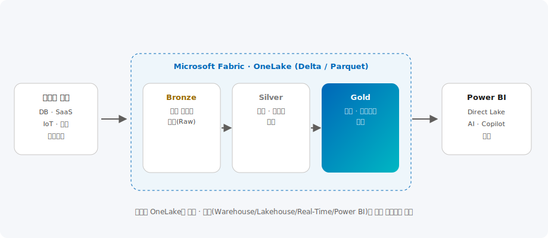

# 데이터 & 애널리틱스

> Microsoft Fabric의 OneLake를 중심으로 데이터 수집·정제·분석·시각화를 하나의 SaaS 플랫폼에서 통합하는 레이크하우스 아키텍처와 분석 시나리오를 제공합니다.

| 항목 | 내용 |
| --- | --- |
| 카테고리 | Data |
| 난이도 | L200 ~ L400 |
| 대상 | 데이터 엔지니어 · 데이터 분석가 · BI 담당자 |
| 관련 서비스 | Microsoft Fabric, OneLake, Power BI, Azure Databricks |

---

## 이 솔루션에서 다루는 내용

모던 데이터 분석은 수집·저장·정제·분석·시각화·거버넌스를 하나의 플랫폼에서 다뤄야 합니다. 본 문서는 아래 6개 영역으로 나누어 다룹니다.

| 영역 | 다루는 주제 | 핵심 서비스 |
| --- | --- | --- |
| **① 단일 데이터 레이크** | 개방형 Delta 저장, 바로가기(Shortcut) | OneLake |
| **② 수집·변환(ETL)** | 200+ 커넥터 파이프라인, Dataflow Gen2 | Data Factory(Fabric) |
| **③ 레이크하우스·웨어하우스** | Spark·T-SQL, 메달리온 계층 | Lakehouse, Warehouse |
| **④ 실시간 분석** | 이벤트 스트림, KQL, Activator | Real-Time Intelligence |
| **⑤ 시각화·AI** | Direct Lake, Copilot 리포팅 | Power BI |
| **⑥ 거버넌스** | 카탈로그·계보·민감도 레이블 | Microsoft Purview |

---

## 개요

전통적인 데이터 플랫폼은 데이터 레이크, 데이터 웨어하우스, 실시간 처리, BI 도구가 제각기 분리되어
데이터 복제·이동·거버넌스에 많은 비용이 들었습니다.

**Microsoft Fabric**은 이 모든 워크로드를 하나의 SaaS로 통합한 분석 플랫폼입니다.
핵심은 **OneLake** — 조직 전체가 공유하는 단일 논리 데이터 레이크로, 모든 데이터를 개방형 **Delta Parquet** 형식으로 저장합니다.
데이터 팩토리·레이크하우스·웨어하우스·실시간 인텔리전스·데이터 사이언스·Power BI 엔진이 **같은 데이터를 복제 없이 공유**합니다.
2024년 GA 이후 **Copilot in Fabric**과 **Real-Time Intelligence**가 추가되어, 자연어 기반 데이터 준비·분석과 스트리밍 분석이 강화되었습니다.

## 아키텍처



Microsoft가 권장하는 **메달리온 아키텍처(Medallion)** 를 OneLake 위에 구현합니다.

1. DB·SaaS·IoT·파일·스트리밍 등 다양한 원본을 **Data Factory** 파이프라인으로 수집합니다.
2. **Bronze(원천 그대로)** → **Silver(정제·표준화)** → **Gold(집계·비즈니스 모델)** 3계층으로 점진적으로 품질을 높입니다.
3. 모든 계층은 OneLake에 개방형 Delta 형식으로 저장되어 엔진 간에 공유됩니다.
4. **Power BI**가 **Direct Lake** 모드로 Gold 데이터를 가져오기·복제 없이 초고속으로 시각화하고, Copilot으로 인사이트를 생성합니다.

```text
원본(DB·SaaS·IoT·파일) → Data Factory 수집
   → Bronze(원천) → Silver(정제) → Gold(집계)  — 모두 OneLake(Delta)
   → Power BI Direct Lake 시각화 + Copilot 인사이트
   ↑ Purview 카탈로그·계보·민감도 레이블로 전 계층 거버넌스
```

---

## 핵심 서비스 상세

### ① OneLake — 조직 단일 데이터 레이크

**무엇인가.** 조직 전체가 공유하는 단일 논리 데이터 레이크로, 모든 데이터를 개방형 **Delta Parquet** 형식으로 저장합니다. "데이터의 OneDrive"라고 불립니다.

**기본 기능** — 데이터 중복 제거, **바로가기(Shortcut)** 로 기존 ADLS·S3·Google Cloud Storage 데이터를 복제 없이 연결, 엔진 간 동일 데이터 공유.

**최신 업데이트** — 멀티클라우드 바로가기 확대, OneLake 보안(테이뺔·폴더별 권한), 카탈로그 통합 강화.

### ② Data Factory(Fabric) — 수집·변환

**무엇인가.** 200종 이상 커넥터 기반의 데이터 수집·변환 파이프라인과 로코드 **Dataflow Gen2**를 제공합니다.

**어떤 시나리오에서 쓰나** — 온프레미스·SaaS 데이터 수집, 예약 기반 배치 적재, 메달리온 계층 변환.

### ③ Lakehouse / Warehouse — 저장·쿼리 엔진

**무엇인가.** Spark 기반 **레이크하우스**(비정형·데이터 엔지니어링)와 T-SQL 기반 **웨어하우스**(정형·SQL 친화)를 워크로드에 맞게 선택합니다.

**최신 업데이트** — 네이티브 실행 엔진 개선, T-SQL 서페스 기능 확대, 레이크하우스 스키마 지원 강화.

### ④ Real-Time Intelligence — 실시간 분석

**무엇인가.** 이벤트 스트림 수집·KQL 분석·실시간 대시보드·자동 반응(**Activator**)을 아우르는 스트리밍 분석 엔진입니다.

**어떤 시나리오에서 쓰나** — IoT 센서 모니터링·이상 탐지, 로그·텔레메트리 분석, 임계값 초과 시 자동 알림.

### ⑤ Power BI — 시각화·Copilot

**무엇인가.** **Direct Lake** 모드로 OneLake의 대용량 데이터를 가져오기·복제 없이 즉시 시각화하고, Copilot으로 리포트·요약을 자동 생성합니다.

**구성 예시 — 레이크하우스에 바로가기로 기존 데이터 연결(개념)**

```text
Lakehouse → 새 바로가기(Shortcut)
  유형: ADLS Gen2
  원본 URL: https://<account>.dfs.core.windows.net/<container>/<path>
  → 복제 없이 OneLake에서 바로 쿼리·시각화 가능
```

> 기존에 Azure Databricks·Synapse·ADLS를 사용 중이라면, OneLake **바로가기(Shortcut)** 로 데이터를 복제 없이 연결해 점진적으로 Fabric으로 전환하는 것이 안전합니다.

## 워크로드 선택 가이드

| 워크로드 | 언어/엔진 | 적합한 경우 |
| --- | --- | --- |
| **Lakehouse** | Spark(PySpark/SQL) | 대용량·비정형, 데이터 엔지니어링 |
| **Warehouse** | T-SQL | 정형 데이터, SQL 개발자 친화 |
| **Real-Time Intelligence** | KQL | IoT·로그·이벤트 스트리밍 분석 |
| **Data Science** | Python/MLflow | 머신러닝 모델 개발·관리 |
| **Power BI** | DAX | 셀프서비스 BI·대시보드 |

## Azure 기본 구성

- **용량(Capacity)**: Fabric 용량(F SKU)을 프로비저닝하고 워크스페이스를 배정, 사용량에 따라 스케일 조정
- **거버넌스**: 워크스페이스별 역할·권한, 민감도 레이블, Purview 연동으로 계보·카탈로그 관리
- **보안**: Entra ID 인증, 관리형 프라이빗 엔드포인트로 데이터 원본을 사설망에 연결
- **CI/CD**: Git 통합과 배포 파이프라인으로 개발→테스트→운영 워크스페이스 승격

## 한국 고객 적용 시나리오

- **제조**: 설비 센서·MES 데이터를 Real-Time Intelligence로 수집·모니터링해 이상 탐지·예지보전, Gold 계층으로 생산 KPI 대시보드 구성
- **유통 · 이커머스**: 매출·재고·고객 행동 데이터를 통합해 수요 예측과 고객 세분화, Direct Lake 기반 실시간 매출 대시보드 제공
- **금융**: 여러 계정계·정보계 데이터를 Silver/Gold로 표준화해 규제 리포팅과 리스크 분석 자동화
- **공공**: 부서별로 흩어진 데이터를 OneLake로 통합하고 Copilot으로 비전문가도 자연어로 데이터 조회

> 기존에 Azure Databricks·Synapse·ADLS를 사용 중이라면, OneLake **바로가기(Shortcut)** 로 데이터를 복제 없이 연결해 점진적으로 Fabric으로 전환하는 것이 안전합니다.

## 고객 사례

- **글로벌 — 통합 분석 플랫폼 전환**: 제조·유통·금융 기업들이 분산된 레이크·웨어하우스·BI를 Microsoft Fabric으로 통합해 데이터 복제 비용을 줄이고 인사이트 도출 시간을 단축했습니다. 상세는 [Microsoft 고객 사례](https://www.microsoft.com/ko-kr/customers)에서 확인할 수 있습니다.
- **패턴 — 실시간 운영 대시보드**: 설비·로그 스트림을 Real-Time Intelligence로 수집해 이상 탐지·예지보전과 실시간 KPI 모니터링을 구현하는 구성이 널리 채택됩니다.
- **패턴 — 셀프서비스 BI 확산**: Copilot in Fabric으로 비전문가도 자연어로 데이터를 조회·분석하도록 지원.

## 도입 단계 (구성 예시 포함)

### 1단계 · 현행 분석 · 목표 정의

- 데이터 원본·이용 사례를 정리하고 우선순위 대시보드/분석 주제 선정

### 2단계 · 레이크하우스 구축

- 용량(F SKU)·워크스페이스 구성, 수집 파이프라인과 메달리온 계층 설계

```bash
# Fabric 용량(F SKU) 프로비저닝
az fabric capacity create \
  --resource-group rg-analytics --capacity-name fabriccap \
  --location koreacentral --sku F64 \
  --administration-members user@contoso.com
```

### 3단계 · 모델링 · 시각화

- Silver/Gold 모델링, Power BI Direct Lake 리포트 및 실시간 대시보드 구성

### 4단계 · 거버넌스 · 확장

- Purview 카탈로그·민감도 레이블, Git 통합 CI/CD, 셀프서비스 분석 확산

## 기대 효과

- 데이터 복제·이동 제거로 저장·운영 비용 절감과 신선도(Freshness) 향상
- 통합 플랫폼으로 데이터 엔지니어·분석가·BI 담당자 간 협업 가속
- Copilot·실시간 분석으로 데이터 기반 의사결정 속도 향상

## 참고 자료

- [Microsoft Fabric 설명서](https://learn.microsoft.com/ko-kr/fabric/)
- [OneLake 개요](https://learn.microsoft.com/ko-kr/fabric/onelake/onelake-overview)
- [메달리온 레이크하우스 아키텍처](https://learn.microsoft.com/ko-kr/fabric/onelake/onelake-medallion-lakehouse-architecture)
- [Power BI Direct Lake](https://learn.microsoft.com/ko-kr/fabric/get-started/direct-lake-overview)
- [실습(Hands-on) — Microsoft Fabric 튜토리얼(엔드투엔드)](https://learn.microsoft.com/ko-kr/fabric/get-started/end-to-end-tutorials)
- [실습(Hands-on) — Fabric Learn Together / Analytics 실습](https://learn.microsoft.com/ko-kr/training/paths/get-started-fabric/)
- [실습(Hands-on) — Real-Time Intelligence 시작하기](https://learn.microsoft.com/ko-kr/training/paths/get-started-fabric-real-time-intelligence/)

---

_카테고리: Data · 최종 업데이트: 2026-07-02_
