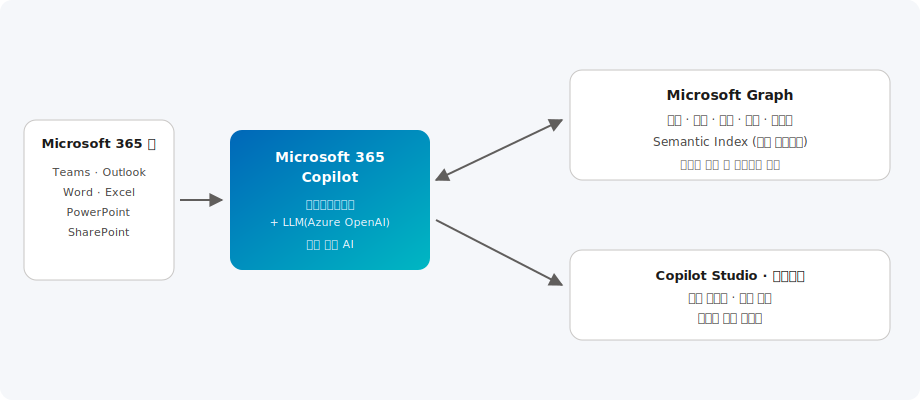

# Microsoft 365 & 협업

> Teams·SharePoint·Microsoft 365 Copilot을 중심으로 조직의 협업과 생산성을 높이고, Copilot Studio로 업무를 자동화하는 모던 워크플레이스 솔루션을 제공합니다.

| 항목 | 내용 |
| --- | --- |
| 카테고리 | Modern Work |
| 난이도 | L100 ~ L300 |
| 대상 | IT 관리자 · 협업/생산성 담당자 · 현업 사용자 |
| 관련 서비스 | Microsoft 365 Copilot, Microsoft Teams, SharePoint, Copilot Studio |

---

## 이 솔루션에서 다루는 내용

모던 워크플레이스는 협업·콘텐리·AI 지원·자동화·거버넌스를 하나로 연결해야 합니다. 본 문서는 아래 6개 영역으로 나누어 다룹니다.

| 영역 | 다루는 주제 | 핵심 서비스 |
| --- | --- | --- |
| **① 협업 허브** | 채팅·회의·통화·리칩 | Microsoft Teams |
| **② 콘텐리·지식** | 문서 관리, Copilot 근거 데이터 | SharePoint, OneDrive |
| **③ AI 생산성** | 초안·요약·분석, Graph 근거 | Microsoft 365 Copilot |
| **④ 맞춤 에이전트** | 로우코드 에이전트, 사내 지식·API 연결 | Copilot Studio |
| **⑤ 업무 자동화** | 현업 주도 앱·플로 자동화 | Power Platform |
| **⑥ 거버넌스** | 민감도 레이블·DLP·감사 | Microsoft Purview |

---

## 개요

하이브리드 근무가 표준이 되면서 조직은 흩어진 협업 도구, 정보 과부하, 반복 업무라는 과제에 직면했습니다.
**Microsoft 365**는 Teams(소통)·SharePoint/OneDrive(콘텐츠)·Outlook(메일/일정)·Loop(공동 작업)를 하나의 생태계로 연결하고,
**Microsoft 365 Copilot**이 이 위에서 생성형 AI로 업무를 지원합니다.

Microsoft 365 Copilot은 대규모 언어 모델(Azure OpenAI)과 **Microsoft Graph**(사용자의 메일·문서·채팅·일정 등 업무 컨텍스트)를 결합합니다.
따라서 웹 검색형 챗봇과 달리 **"우리 조직의 데이터"에 근거한** 초안 작성·요약·분석을 수행하며, 각 사용자의 기존 권한 범위 안에서만 데이터에 접근합니다.

## 아키텍처



1. 사용자가 Teams·Word·Excel·Outlook·PowerPoint 등 익숙한 앱에서 Copilot에 요청합니다.
2. **Microsoft 365 Copilot 오케스트레이션**이 요청을 받아, LLM 호출 전후로 **Microsoft Graph**에서 관련 업무 컨텍스트(문서·메일·채팅)를 조회합니다.
3. Semantic Index가 조직 데이터를 의미 기반으로 검색해 근거를 제공하고, 책임 있는 AI 필터가 적용됩니다.
4. **Copilot Studio**로 사내 시스템·지식을 연결한 맞춤형 에이전트를 만들어 특정 업무를 자동화합니다.

> Copilot이 처리하는 프롬프트·응답·Graph 데이터는 조직의 Microsoft 365 서비스 경계 안에서 처리되며, 기반 LLM 학습에 사용되지 않습니다.

```text
사용자 요청(Teams·Word·Outlook) → Copilot 오케스트레이션
   → Microsoft Graph + Semantic Index에서 근거(문서·메일·채팅) 조회
   → LLM(Azure OpenAI) 생성 → 책임 있는 AI 필터 → 근거와 함께 응답
   ↑ 사용자 기존 권한(RBAC) 범위 안에서만 데이터 접근
```

---

## 핵심 서비스 상세

### ① Microsoft 365 Copilot — 업무 맥락 기반 AI

**무엇인가.** LLM(Azure OpenAI)과 **Microsoft Graph**(메일·문서·채팅·일정 등 업무 맥락)를 결합해 "우리 조직 데이터"에 근거한 초안·요약·분석을 수행합니다.

**기본 기능** — Word/Excel/PowerPoint/Outlook/Teams 전반의 생성·요약·분석, 비즈니스 채팅(Copilot Chat), 각 사용자 권한 범위 내 접근.

**최신 업데이트** — **Copilot 에이전트**(업무별 맞춤 에이전트)와 에이전트 스토어, Copilot Chat 무료 사용 확대, 액션 기반 에이전트로 다단계 업무 자동화.

### ② Microsoft Teams — 협업 허브

**무엇인가.** 채팅·회의·통화·협업을 모은 허브로, Copilot의 주요 접점입니다.

**기본 기능** — 회의 요약·인텔리전트 리칩, 놀친 대화 따라잡기, 액션 아이템 정리, 실시간 통역.

**어떤 시나리오에서 쓰나** — 회의가 많은 조직의 회의록 자동화, 재택·협력사 협업, Copilot Studio 에이전트 배포 채널.

### ③ SharePoint · OneDrive — 콘텐리·근거 데이터

**무엇인가.** 문서 관리와 지식 포털이며, Copilot이 참조하는 가장 중요한 근거 데이터 소스입니다.

> Copilot 품질은 콘텐트 권한 위생에 좌우됩니다. **과다 공유(Oversharing) 제거**와 민감도 레이블이 도입 전 필수 작업입니다. SharePoint Advanced Management로 오버셰어링을 점검하세요.

### ④ Copilot Studio — 맞춤 에이전트

**무엇인가.** 로우코드로 사내 데이터·API를 연결한 맞춤 Copilot 에이전트를 구축·배포합니다.

**구성 예시 — 에이전트 만들기(개념 흐름)**

```text
Copilot Studio → 새 에이전트
  지식 원본: SharePoint 사이트(사내 규정·매뉴얼)
  액션: Power Automate 플로(결재·요청 처리)
  채널: Teams에 게시
  인증: Entra ID SSO + DLP 정책 적용
```

## 대표 활용

| 앱 | Copilot 활용 예 |
| --- | --- |
| **Teams** | 회의 요약, 놓친 대화 따라잡기, 액션 아이템 정리 |
| **Outlook** | 메일 초안·요약, 스레드 정리, 회신 코칭 |
| **Word** | 초안 생성, 문서 요약·재작성 |
| **Excel** | 데이터 분석·수식 제안·인사이트 |
| **PowerPoint** | 문서→슬라이드 자동 생성, 디자인 제안 |

## 도입 · 기본 구성

- **라이선스 · 전제조건**: Microsoft 365 E3/E5 등 기반 라이선스 + Copilot 라이선스, Entra ID·OneDrive·Teams 사용 환경
- **데이터 준비(중요)**: Copilot이 참조할 SharePoint·문서의 **접근 권한을 정비**(과다 공유 제거). SharePoint Advanced Management·민감도 레이블로 오버셰어링 방지
- **거버넌스**: Microsoft Purview로 민감도 레이블·DLP 적용, Copilot 상호작용 감사 로그 관리
- **채택(Adoption)**: 파일럿 그룹 선정 → 시나리오 교육 → 사용 현황 대시보드로 효과 측정·확산

## 한국 고객 적용 시나리오

- **대기업 · 사무 생산성**: 회의가 많은 조직에서 Teams 인텔리전트 리캡으로 회의록·액션 아이템을 자동화하고, 메일·보고서 초안 작성 시간을 단축
- **제조 · 현장**: SharePoint의 작업 표준·안전 매뉴얼을 Copilot Studio 에이전트로 연결해 현장 직원이 Teams에서 자연어로 질의
- **금융 · 공공(규제)**: 민감도 레이블·DLP로 정보 보호를 유지하면서, 내부 규정·정책 문서 기반의 사내 지식 Copilot 제공
- **중견기업**: Power Platform으로 결재·요청 프로세스를 자동화하고 Copilot으로 반복 문서 작업을 지원

## 고객 사례

- **글로벌 — 생산성 향상**: 다양한 산업의 조직이 Microsoft 365 Copilot으로 회의 요약·메일 초안·문서 작성 시간을 단축했으며, 상세는 [Microsoft 365 Copilot 고객 사례](https://www.microsoft.com/ko-kr/microsoft-365/copilot)와 [Microsoft 고객 사례](https://www.microsoft.com/ko-kr/customers)에서 확인할 수 있습니다.
- **패턴 — 회의록 자동화**: Teams 인텔리전트 리칩으로 회의록·액션 아이템을 자동 정리하는 구성이 널리 채택됩니다.
- **패턴 — 사내 지식 에이전트**: Copilot Studio로 SharePoint 규정·매뉴얼을 연결해 Teams에서 자연어로 질의하는 업무 지원 봇 구현.

## 도입 단계 (구성 예시 포함)

### 1단계 · 준비 · 파일럿

- 라이선스 확보, 권한·데이터 정비, 파일럿 그룹과 우선 시나리오 선정

### 2단계 · 거버넌스 구성

- 민감도 레이블·DLP·감사 로그, 과다 공유(오버셰어링) 점검

```text
Microsoft Purview:
  민감도 레이블: 기밀 / 대외비 → 자동 분류·암호화
  DLP 정책: 외부 공유 시 차단/경고
  SharePoint Advanced Management: 과다 공유 보고서 검토
```

### 3단계 · 에이전트 구축

- Copilot Studio로 부서별 맞춤 시나리오(지식·자동화) 구현, Teams 채널에 배포

### 4단계 · 채택 · 확산

- 교육·챔피언 운영, 사용 지표 기반 효과 측정 및 전사 확산

## 기대 효과

- 회의·메일·문서 등 반복 업무 시간 단축으로 핵심 업무 집중도 향상
- 조직 지식 검색·활용 접근성 개선과 신입 온보딩 가속
- 보안·규정 준수를 유지하면서 전사 생산성 향상

## 참고 자료

- [Microsoft 365 Copilot 설명서](https://learn.microsoft.com/ko-kr/copilot/microsoft-365/)
- [Microsoft 365 Copilot 배포 가이드](https://learn.microsoft.com/ko-kr/copilot/microsoft-365/microsoft-365-copilot-setup)
- [Copilot Studio 설명서](https://learn.microsoft.com/ko-kr/microsoft-copilot-studio/)
- [Microsoft 365 채택(Adoption) 허브](https://adoption.microsoft.com/ko-kr/)
- [실습(Hands-on) — Copilot Studio로 에이전트 만들기](https://learn.microsoft.com/ko-kr/training/paths/copilot-studio-fundamentals/)
- [실습(Hands-on) — Microsoft 365 Copilot 사용 교육](https://learn.microsoft.com/ko-kr/training/paths/get-started-microsoft-365-copilot/)
- [실습(Hands-on) — Copilot 배포를 위한 데이터 준비](https://learn.microsoft.com/ko-kr/training/paths/prepare-microsoft-365-copilot/)

---

_카테고리: Modern Work · 최종 업데이트: 2026-07-02_
