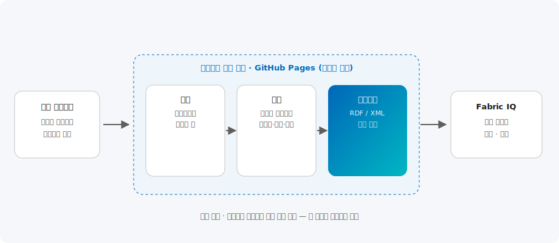

# Ontology Playground

> 온톨로지와 Microsoft Fabric IQ를 브라우저에서 직접 탐색·설계·학습하는 한국어 인터랙티브 데모.

| 항목 | 내용 |
| --- | --- |
| 카테고리 | Data |
| 난이도 | L100 ~ L300 |
| 대상 | 데이터 아키텍트 / 개발자 / 온톨로지 입문자 |
| 예상 소요 | 30분 ~ 반나절 |

---

## 데모 바로가기

**[▶ 라이브 데모 열기](demo/)**

> 백엔드 없이 동작하는 정적 웹앱입니다. 새 탭에서 열어 자유롭게 탐색해 보세요.

## 개요

온톨로지(Ontology)는 도메인의 개념(엔티티)과 그 관계를 형식적으로 표현한 지식 모델로, **Microsoft Fabric IQ**의 핵심 구성 요소입니다. 서로 다른 시스템에 흩어진 데이터를 공통의 의미 체계로 연결해 사람과 AI가 동일한 맥락에서 데이터를 이해하도록 돕습니다.

Ontology Playground는 설치나 백엔드 없이 브라우저에서 바로 실행되는 정적 웹앱입니다. 미리 구축된 온톨로지 카탈로그를 탐색하고, 시각적 디자이너로 직접 도메인 모델을 설계하며, RDF/XML로 내보내고, 단계별 학습 경로와 퀘스트로 개념을 익힐 수 있습니다. 본 데모는 한국어로 현지화되어 국내 사용자가 쉽게 접근할 수 있습니다.

## 아키텍처

전 과정이 브라우저에서 실행되는 클라이언트 사이드 정적 애플리케이션으로, GitHub Pages에서 서빙됩니다. 온톨로지 카탈로그와 학습 콘텐츠는 빌드 시점에 JSON으로 컴파일되어 정적으로 로드되며, 설계 결과는 표준 RDF/XML로 내보내 Microsoft Fabric IQ 등 외부 플랫폼에서 활용할 수 있습니다.

## 주요 구성 요소

- **온톨로지 카탈로그** — 소매·헬스케어·금융·제조 등 산업별 예제 온톨로지와 커뮤니티 기여 모델을 그래프로 탐색
- **비주얼 디자이너** — 엔티티·관계·속성을 시각적으로 설계하고 RDF/XML로 내보내기
- **쿼리 플레이그라운드** — 자연어 스타일 질의로 온톨로지 구조를 탐색
- **학습 경로 & 퀘스트** — 13개 코스와 실습형 단계별 과제로 온톨로지 설계 원칙 습득

## 도입 단계

1. **탐색(Explore)** — 카탈로그에서 예제 온톨로지를 열어 그래프로 개념 이해
2. **설계(Design)** — 디자이너로 나만의 도메인 모델 작성
3. **내보내기(Export)** — RDF/XML로 추출해 Fabric IQ 등에 활용
4. **학습(Learn)** — 학습 경로와 퀘스트로 설계 역량 강화

## 기대 효과

- 온톨로지·지식 그래프 개념의 빠른 이해와 사내 확산
- Fabric IQ 도입 전 사전 학습 및 프로토타이핑
- 팀 간 공통 데이터 모델을 시각적으로 커뮤니케이션

## 참고 자료

- 원본 프로젝트: [microsoft/Ontology-Playground](https://github.com/microsoft/Ontology-Playground) (MIT License)
- 본 데모는 위 프로젝트의 **한국어 현지화 배포본**입니다.
- [Microsoft Fabric 문서](https://learn.microsoft.com/ko-kr/fabric/)
- [Azure 아키텍처 센터](https://learn.microsoft.com/ko-kr/azure/architecture/)

---

_최종 업데이트: 2026-07-03_
