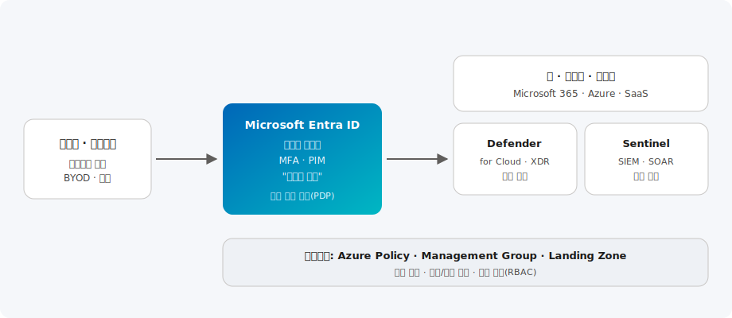

# 보안 & 거버넌스

> "절대 신뢰하지 않고 항상 검증한다"는 Zero Trust 원칙을 기반으로, Microsoft Entra ID·Defender·Sentinel과 Azure 거버넌스를 통합한 엔터프라이즈 보안 아키텍처를 제공합니다.

| 항목 | 내용 |
| --- | --- |
| 카테고리 | Security |
| 난이도 | L200 ~ L400 |
| 대상 | 보안 담당자(CISO/SOC) · 인프라 아키텍트 · 컴플라이언스 |
| 관련 서비스 | Microsoft Entra ID, Microsoft Defender, Microsoft Sentinel, Azure Policy |

---

## 이 솔루션에서 다루는 내용

Zero Trust는 하나의 제품이 아니라 ID·엔드포인트·앱·데이터·인프라·네트워크 전반에 걸친 보안 아키텍처입니다. 본 문서는 아래 6개 영역으로 나누어 다룹니다.

| 영역 | 다루는 주제 | 핵심 서비스 |
| --- | --- | --- |
| **① ID(정책 결정)** | 조건부 액세스, MFA, PIM, ID 거버넌스 | Microsoft Entra ID |
| **② 위협 보호** | CSPM·CWPP, 엔드포인트·ID·메일 XDR | Defender for Cloud, Defender XDR |
| **③ 통합 관제(SIEM/SOAR)** | 로그 통합, 상관 분석, 자동 대응 | Microsoft Sentinel |
| **④ 데이터 보안** | 분류·레이블·DLP, 감사 | Microsoft Purview |
| **⑤ 거버넌스** | 정책 코드화, 관리 그룹, 랜딩 존 | Azure Policy, Management Group |
| **⑥ 보안 운영 가속** | 생성형 AI 기반 인시던트 분석 | Security Copilot |

---

## 개요

클라우드·모바일·원격 근무 환경에서는 "내부망은 안전하다"는 전통적 경계 보안(Perimeter)이 더 이상 유효하지 않습니다.
**Zero Trust(제로 트러스트)** 는 다음 세 가지 원칙을 전제로 합니다.

1. **명시적으로 확인(Verify explicitly)** — 모든 접근을 ID·디바이스·위치·위험도 등 가용한 신호로 검증
2. **최소 권한 사용(Use least privilege)** — 필요한 만큼만, 필요한 시간 동안만 권한 부여(JIT/JEA)
3. **침해 가정(Assume breach)** — 이미 침해된 것으로 가정하고 폭발 반경(Blast radius)을 최소화

본 솔루션은 ID를 새로운 보안 경계로 삼아 **Entra ID(정책 결정)**, **Defender(위협 보호)**, **Sentinel(통합 관제)**, **Azure 거버넌스(규정 준수)** 를 하나의 체계로 연결합니다.

## 아키텍처



Microsoft 아키텍처 센터의 **Zero Trust 및 Azure 랜딩 존** 가이드를 기반으로 합니다.

1. 사용자·디바이스가 어디서나 리소스에 접근을 시도합니다.
2. **Microsoft Entra ID**가 정책 결정 지점(PDP) 역할을 하여, 조건부 액세스로 MFA·디바이스 준수·위험 신호를 평가해 허용/차단/추가 인증을 결정합니다.
3. 허용된 접근만 **앱·데이터·인프라**에 도달하며, **Microsoft Defender**가 워크로드·엔드포인트·클라우드 리소스의 위협을 실시간 탐지·차단합니다.
4. 모든 로그·경고는 **Microsoft Sentinel(SIEM/SOAR)** 로 수집되어 상관 분석·자동 대응됩니다.
5. **Azure Policy·Management Group·Landing Zone**이 전체 환경의 규정 준수와 최소 권한을 강제합니다.

```text
사용자·디바이스 → [Entra ID 조건부 액세스: MFA·디바이스 준수·위험도]
   → 허용된 접근만 앱·데이터·인프라 도달 (Defender 위협 탐지)
   → 모든 로그 → Sentinel(SIEM/SOAR) 상관 분석·자동 대응
   ↑ Azure Policy·관리 그룹·랜딩 존이 전 구독에 규정 준수 강제
```

---

## 핵심 서비스 상세

### ① Microsoft Entra ID — ID가 새로운 경계

**무엇인가.** 클라우드 ID·액세스 관리(IAM)의 중심으로, Zero Trust의 **정책 결정 지점(PDP)** 역할을 합니다.

**기본 기능** — 조건부 액세스, 다단계 인증(MFA), Privileged Identity Management(PIM, JIT 권한 승격), ID 거버넌스(액세스 검토·수명 주기 관리), 레거시 인증 차단.

**최신 업데이트** — **암호 없는(Passwordless)·패스키** 인증 확대, **인증 강도(Authentication Strength)** 정책, 조건부 액세스에 **토큰 보호(Token Protection)**·위험 기반 정책 강화.

**어떤 시나리오에서 쓰나** — 재택·협력사 접근 통제, 관리자 계정 보호, 규제 산업의 접근 증적.

**구성 예시 — 관리자 계정에 MFA 요구(조건부 액세스 개념)**

```text
조건부 액세스 정책:
  대상: '전역 관리자' 등 특권 역할
  조건: 모든 위치·모든 클라이언트 앱
  제어: 액세스 허용 + MFA 필요 + 준수된 디바이스 필요
```

### ② Microsoft Defender — 위협 보호(XDR + CSPM/CWPP)

**무엇인가.** **Defender for Cloud**(클라우드 보안 태세 관리 CSPM + 워크로드 보호 CWPP)와 **Defender XDR**(엔드포인트·ID·메일·앱 확장 탐지·대응)로 구성됩니다.

**기본 기능** — 보안 점수 기반 개선 권고, 서버·컨테이너·DB·스토리지 워크로드 보호, 엔드포인트 EDR, 공격 경로 분석.

**최신 업데이트** — Defender·Sentinel이 **통합 Defender 포털**로 수렴, **클라우드 보안 그래프**로 공격 경로 시각화, 컨테이너·API 보안 확장.

**어떤 시나리오에서 쓰나** — 멀티클라우드 태세 관리, 워크로드 위협 차단, 전담 SOC가 없는 조직의 자동 탐지·대응.

### ③ Microsoft Sentinel — 클라우드 네이티브 SIEM/SOAR

**무엇인가.** 클라우드 규모의 로그를 수집·상관 분석하고 플레이북으로 자동 대응하는 통합 관제 플랫폼입니다.

**기본 기능** — 데이터 커넥터, 분석 규칙(상관 분석), 인시던트 관리, 위협 헌팅, SOAR 플레이북(Logic Apps).

**최신 업데이트** — Defender 포털 통합, **UEBA**(사용자·엔터티 행위 분석), Security Copilot 연계로 인시던트 요약·조사 자동화.

> Defender와 Sentinel은 이제 **통합 Defender 포털**에서 하나의 경험으로 운영됩니다. 신규 구성 시 통합 포털을 기준으로 설계하세요.

### ④ Microsoft Purview · Azure Policy — 데이터 보안과 거버넌스

**무엇인가.** Purview는 데이터 분류·민감도 레이블·DLP·감사를, Azure Policy·관리 그룹은 **규정 준수를 코드로** 강제하는 거버넌스 계층입니다.

**구성 예시 — 저장소 계정 퍼블릭 접근 금지(정책)**

```bash
# 내장 정책을 관리 그룹에 할당해 전 구독에 강제
az policy assignment create \
  --name deny-storage-public \
  --scope /providers/Microsoft.Management/managementGroups/corp \
  --policy "4fa4b6c0-31ca-4c0d-b10d-24b96f62a751"  # Storage 퍼블릭 접근 거부
```

## Zero Trust 적용 영역

| 영역 | 핵심 통제 | 대표 서비스 |
| --- | --- | --- |
| **ID** | MFA·조건부 액세스·PIM | Entra ID |
| **엔드포인트** | 디바이스 준수·EDR | Intune · Defender for Endpoint |
| **앱** | 접근 제어·섀도우 IT 탐지 | Defender for Cloud Apps |
| **데이터** | 분류·레이블·DLP | Microsoft Purview |
| **인프라** | 태세 관리·워크로드 보호 | Defender for Cloud |
| **네트워크** | 마이크로세분화·사설 접근 | Azure Firewall · Private Link |

## Azure 기본 구성

- **ID 우선**: 모든 사용자에 MFA 적용, 관리자 계정은 PIM으로 JIT 승격, 레거시 인증 차단
- **랜딩 존**: 관리 그룹 계층과 Azure Policy로 규정 준수 기준(예: 암호화 강제, 퍼블릭 IP 제한)을 구독 전체에 코드로 배포
- **네트워크 격리**: Hub-Spoke + Azure Firewall, Private Endpoint로 PaaS를 사설망에 격리
- **통합 관제**: 모든 리소스 진단 로그를 Log Analytics로 집중, Sentinel에서 상관 분석·자동 대응(플레이북) 구성

## 한국 고객 적용 시나리오

- **금융 · 공공(규제 산업)**: ISMS-P·전자금융감독규정 대응을 위해 접근 통제·감사 로그·권한 검토를 Entra ID Governance와 Sentinel로 자동화·증적화
- **제조 · 대기업**: 재택·협력사 접근에 조건부 액세스와 디바이스 준수 정책을 적용해 안전한 하이브리드 근무 환경 구성
- **중견기업 · SOC 부재**: 전담 보안팀이 없는 조직이 Defender XDR + Sentinel로 24/7 위협 탐지·자동 대응 체계를 신속히 확보
- **다계열사 그룹**: 관리 그룹·Azure Policy로 계열사별 구독에 일관된 보안 표준과 최소 권한을 강제

> 국내 규제 대응 시 감사 요구사항(로그 보존 기간·접근 기록·권한 변경 이력)을 초기 설계에 반영하고, Microsoft Purview로 데이터 분류·DLP를 함께 구성하는 것을 권장합니다.

## 고객 사례

- **글로벌 — SOC 현대화**: 다수의 기업이 Defender XDR + Sentinel로 로그를 통합하고 자동 대응(SOAR)을 도입해 위협 탐지·대응 시간(MTTD/MTTR)을 크게 단축했습니다. 상세 사례는 [Microsoft 보안 고객 사례](https://www.microsoft.com/ko-kr/security/blog/)에서 확인할 수 있습니다.
- **패턴 — 규제 산업 접근 통제**: 금융·공공이 조건부 액세스·PIM·정기 액세스 검토를 자동화해 증적 부담을 줄이는 구성이 널리 채택됩니다.
- **패턴 — 랜딩 존 거버넌스**: 관리 그룹·Azure Policy로 계열사·부서별 구독에 일관된 보안 표준을 코드로 강제.

## 도입 단계 (구성 예시 포함)

### 1단계 · 평가(Assess)

- Defender for Cloud 보안 점수와 ID 보안 점수로 현행 태세 진단, 리스크 우선순위화
- 레거시 인증·과다 권한·미보호 워크로드 식별

### 2단계 · ID 강화

- MFA·조건부 액세스·PIM 적용, 레거시 인증 제거, 관리자 권한 최소화

```bash
# Log Analytics 작업 영역 생성 후 Sentinel 온보딩 준비
az monitor log-analytics workspace create \
  --resource-group rg-security --workspace-name law-soc --location koreacentral
```

### 3단계 · 위협 보호 · 관제

- Defender for Cloud 워크로드 보호 활성화, Sentinel로 로그 통합 및 자동 대응(플레이북) 구성

```bash
# 구독에 Defender for Cloud(서버 플랜) 활성화
az security pricing create --name VirtualMachines --tier Standard
```

### 4단계 · 거버넌스 표준화

- 랜딩 존·Azure Policy로 규정 준수 코드화, 정기 액세스 검토 자동화, 진단 로그 중앙 집중

## 기대 효과

- ID 기반 통제로 자격 증명 탈취·측면 이동 위험 감소
- 통합 관제·자동 대응으로 위협 탐지·대응 시간(MTTD/MTTR) 단축
- 정책 코드화로 규정 준수를 지속·자동으로 유지하고 감사 대응력 강화

## 참고 자료

- [Zero Trust 지침 센터](https://learn.microsoft.com/ko-kr/security/zero-trust/)
- [Microsoft Entra 조건부 액세스 설명서](https://learn.microsoft.com/ko-kr/entra/identity/conditional-access/)
- [Microsoft Sentinel 설명서](https://learn.microsoft.com/ko-kr/azure/sentinel/)
- [아키텍처 센터 — Azure 랜딩 존](https://learn.microsoft.com/ko-kr/azure/cloud-adoption-framework/ready/landing-zone/)
- [Microsoft Defender for Cloud 설명서](https://learn.microsoft.com/ko-kr/azure/defender-for-cloud/)
- [실습(Hands-on) — Microsoft Sentinel Training Lab](https://github.com/Azure/Azure-Sentinel/tree/master/Sample%20Data)
- [실습(Hands-on) — Microsoft Learn: Zero Trust 보안 구현](https://learn.microsoft.com/ko-kr/training/paths/implement-security-controls-maintain-security-posture/)
- [실습(Hands-on) — Entra 조건부 액세스 구성](https://learn.microsoft.com/ko-kr/training/modules/plan-implement-administer-conditional-access/)

---

_카테고리: Security · 최종 업데이트: 2026-07-02_
